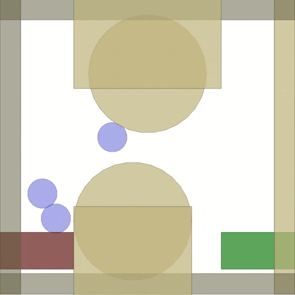

# Multi-Agent Particle Environment from OpenAI's [muliti-agent-particle-env](https://github.com/openai/multiagent-particle-envs)
## Relevant scenarios are: `simple_port.py` and `2_agents_demo.py`
### modified files include: `core.py`, `rendering.py` and `environment.py`. The environment extends the the functionality of multiagent-particle-env, all original scenarios are unaffected.

A simple multi-agent particle world with a continuous observation and discrete action space, along with some basic simulated physics.
Used in the paper [Multi-Agent Actor-Critic for Mixed Cooperative-Competitive Environments](https://arxiv.org/pdf/1706.02275.pdf).

## Getting started:

- To install, `cd` into the root directory and type `pip install -e .`

- To interactively view moving to landmark scenario (see others in ./scenarios/):
`bin/interactive.py --scenario simple.py`

- Known dependencies: Python (3.5.4), OpenAI gym (0.10.5), numpy (1.14.5)

- To use the environments, look at the code for importing them in `make_env.py`.

## Code structure

- `make_env.py`: contains code for importing a multiagent environment as an OpenAI Gym-like object.

- `./multiagent/environment.py`: contains code for environment simulation (interaction physics, `_step()` function, etc.)

- `./multiagent/core.py`: contains classes for various objects (Entities, Landmarks, Agents, etc.) that are used throughout the code.

- `./multiagent/rendering.py`: used for displaying agent behaviors on the screen.

- `./multiagent/policy.py`: contains code for interactive policy based on keyboard input.

- `./multiagent/scenario.py`: contains base scenario object that is extended for all scenarios.

- `./multiagent/scenarios/`: folder where various scenarios/ environments are stored. scenario code consists of several functions:
    1) `make_world()`: creates all of the entities that inhabit the world (landmarks, agents, etc.), assigns their capabilities (whether they can communicate, or move, or both).
     called once at the beginning of each training session
    2) `reset_world()`: resets the world by assigning properties (position, color, etc.) to all entities in the world
    called before every episode (including after make_world() before the first episode)
    3) `reward()`: defines the reward function for a given agent
    4) `observation()`: defines the observation space of a given agent
    5) (optional) `benchmark_data()`: provides diagnostic data for policies trained on the environment (e.g. evaluation metrics)

### Creating new environments

You can create new scenarios by implementing the first 4 functions above (`make_world()`, `reset_world()`, `reward()`, and `observation()`).

## List of environments

| Env name in code (name in paper) |  Communication? | Competitive? | Notes |
| --- | --- | --- | --- |
| `simple.py` | N | N | Single agent sees landmark position, rewarded based on how close it gets to landmark. Not a multiagent environment -- used for debugging policies. |
| `simple_adversary.py` (Physical deception) | N | Y | 1 adversary (red), N good agents (green), N landmarks (usually N=2). All agents observe position of landmarks and other agents. One landmark is the ‘target landmark’ (colored green). Good agents rewarded based on how close one of them is to the target landmark, but negatively rewarded if the adversary is close to target landmark. Adversary is rewarded based on how close it is to the target, but it doesn’t know which landmark is the target landmark. So good agents have to learn to ‘split up’ and cover all landmarks to deceive the adversary. |
| `simple_crypto.py` (Covert communication) | Y | Y | Two good agents (alice and bob), one adversary (eve). Alice must sent a private message to bob over a public channel. Alice and bob are rewarded based on how well bob reconstructs the message, but negatively rewarded if eve can reconstruct the message. Alice and bob have a private key (randomly generated at beginning of each episode), which they must learn to use to encrypt the message. |
| `simple_push.py` (Keep-away) | N |Y  | 1 agent, 1 adversary, 1 landmark. Agent is rewarded based on distance to landmark. Adversary is rewarded if it is close to the landmark, and if the agent is far from the landmark. So the adversary learns to push agent away from the landmark. |
| `simple_reference.py` | Y | N | 2 agents, 3 landmarks of different colors. Each agent wants to get to their target landmark, which is known only by other agent. Reward is collective. So agents have to learn to communicate the goal of the other agent, and navigate to their landmark. This is the same as the simple_speaker_listener scenario where both agents are simultaneous speakers and listeners. |
| `simple_speaker_listener.py` (Cooperative communication) | Y | N | Same as simple_reference, except one agent is the ‘speaker’ (gray) that does not move (observes goal of other agent), and other agent is the listener (cannot speak, but must navigate to correct landmark).|
| `simple_spread.py` (Cooperative navigation) | N | N | N agents, N landmarks. Agents are rewarded based on how far any agent is from each landmark. Agents are penalized if they collide with other agents. So, agents have to learn to cover all the landmarks while avoiding collisions. |
| `simple_tag.py` (Predator-prey) | N | Y | Predator-prey environment. Good agents (green) are faster and want to avoid being hit by adversaries (red). Adversaries are slower and want to hit good agents. Obstacles (large black circles) block the way. |
| `simple_world_comm.py` | Y | Y | Environment seen in the video accompanying the paper. Same as simple_tag, except (1) there is food (small blue balls) that the good agents are rewarded for being near, (2) we now have ‘forests’ that hide agents inside from being seen from outside; (3) there is a ‘leader adversary” that can see the agents at all times, and can communicate with the other adversaries to help coordinate the chase. |

## Paper citation

If you used this environment for your experiments or found it helpful, consider citing the following papers:

Environments in this repo:
<pre>
@article{lowe2017multi,
  title={Multi-Agent Actor-Critic for Mixed Cooperative-Competitive Environments},
  author={Lowe, Ryan and Wu, Yi and Tamar, Aviv and Harb, Jean and Abbeel, Pieter and Mordatch, Igor},
  journal={Neural Information Processing Systems (NIPS)},
  year={2017}
}
</pre>

Original particle world environment:
<pre>
@article{mordatch2017emergence,
  title={Emergence of Grounded Compositional Language in Multi-Agent Populations},
  author={Mordatch, Igor and Abbeel, Pieter},
  journal={arXiv preprint arXiv:1703.04908},
  year={2017}
}
</pre>
